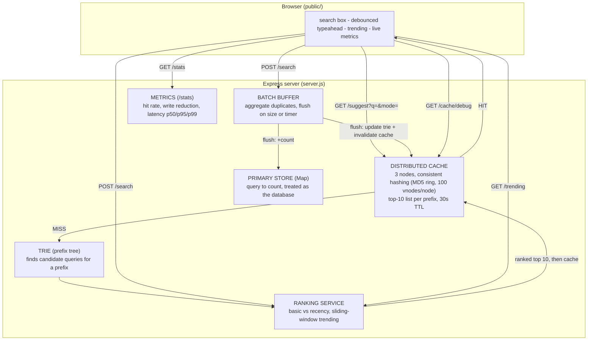

# Project Report - Search Typeahead System

**Stack:** Node.js + Express backend, vanilla HTML/CSS/JS frontend. No database
server, no Redis, no build tools - everything runs in-process so the whole
project starts with one command.

---

## 1. Architecture



### Component responsibilities

| Component | In code | Responsibility |
|---|---|---|
| **Trie** | `src/core/Trie.js` | Prefix tree. Given a prefix, collects all queries that start with it. |
| **Primary store** | `src/core/PrimaryStore.js` | The "database". `query -> count`. Counts reads and writes. |
| **Distributed cache** | `src/core/DistributedCache.js` | 3 cache nodes (3 Maps), each like a separate cache server. Caches the top-10 list per prefix. 30s TTL. |
| **Consistent hashing** | `src/core/ConsistentHashRing.js` | MD5 hash ring with 100 virtual nodes per cache node; decides which node owns a prefix. |
| **Ranking / trending** | `src/core/RankingService.js` | Basic (count) vs recency ranking; trending from a sliding window of recent searches. |
| **Batch writer** | `src/core/BatchWriter.js` | Buffers search submissions, merges duplicates, flushes by size (500) or timer (1s). |
| **Orchestrator** | `src/core/TypeaheadService.js` | Wires the read path (cache -> trie -> rank) and write path (record + enqueue) together. |
| **Metrics** | `src/server.js` /stats | Cache hit rate, write reduction, suggestion latency percentiles. |

**Suggestion flow:** request -> check the owning cache node -> **HIT** returns
the saved list instantly; **MISS** asks the trie for candidates, the ranking
service orders them, the top 10 is cached, and returned.

**Search flow:** `POST /search` returns `{"message":"Searched"}` immediately,
records the query for trending/recency, and pushes the count update into the
batch buffer. On the next flush the store count is updated, the trie is updated,
and affected cached prefixes are invalidated.

---

## 2. Dataset - source and loading

- **Source:** synthetically generated by `scripts/generate-dataset.js`. The
  assignment allows any dataset and permits deriving counts, so a synthetic set
  keeps the project self-contained (no downloads).
- **Size:** **120,000** unique queries (exceeds the 100k minimum).
- **Format:** `data/queries.json` = `[{ "query": "iphone 15", "count": 85000 }, ...]`
- **How counts are derived:** queries are built from brand / product / topic +
  modifier combinations; counts follow a Zipf-like distribution (head terms are
  far more popular than the long tail).

**Loading:**

```bash
npm install            # installs express
npm run gen-data       # builds data/queries.json (120,000 queries) - run once
npm start              # loads the dataset into the store + trie, serves :3000
```

On boot, the server reads `data/queries.json`, fills the primary store, and
inserts every query into the trie (logged: `loaded 120000 queries...`).

---

## 3. API documentation

Base URL: `http://localhost:3000`

### `GET /suggest?q=<prefix>&mode=basic|recency`
Up to 10 prefix-matching suggestions. `mode` defaults to `recency`.
```json
{
  "prefix": "iph", "mode": "recency", "source": "cache",
  "node": "cache-1", "latencyMs": 0.04,
  "suggestions": [ { "query": "iphone", "count": 200002 } ]
}
```
- `source`: `cache` (hit) or `compute` (built from trie + ranking). `node`: owning cache node.
- Edge cases: empty/missing `q` -> `{ "suggestions": [] }`; input is lowercased (mixed-case safe); no matches -> `[]`.

### `POST /search` - body `{ "query": "..." }`
Records a search (queued for batched write) and returns the dummy response.
```json
{ "message": "Searched", "query": "iphone 15", "accepted": true }
```

### `GET /trending?limit=`
Top queries by recent activity in the sliding window.
```json
{ "trending": [ { "query": "iphone 15", "recent": 3 } ] }
```

### `GET /cache/debug?prefix=<p>&mode=basic|recency`
Which cache node owns the prefix, and whether it is cached.
```json
{ "prefix": "iph", "mode": "recency", "node": "cache-1", "status": "hit", "cachedCount": 10 }
```

### `GET /stats`
Performance numbers used below.
```json
{
  "cache": { "hits": 9, "misses": 34, "hitRate": 0.209, "nodeCount": 3, "perNode": {} },
  "batch": { "enqueued": 62, "writesIssued": 7, "writeReduction": 0.887 },
  "store": { "reads": 0, "writes": 7, "distinctQueries": 120000 },
  "latency": { "p50": 0.19, "p95": 0.31, "p99": 1.2 }
}
```

### `GET /cache/distribution`
Key count per cache node over a dataset sample (shows the consistent-hashing spread).

---

## 4. Design choices and trade-offs

**In-memory `Map` as the primary store.** Simplicity - the assignment targets the
data-system design, not a specific DB engine. The Map gives a clean place to
count reads/writes and prove the batching win. *Trade-off:* not durable; data is
reloaded from `queries.json` on restart.

**Trie for prefix lookup.** A trie walks straight to the prefix node in
O(prefix length) and then collects the queries below it, instead of scanning all
120k rows for every keystroke. *Trade-off:* on a very short prefix the subtree is
large, so the first (cold) lookup still does real work - but the cache makes
repeat lookups effectively free.

**Consistent hashing for the distributed cache.** Node chosen by `MD5(prefix)`
on a ring with 100 virtual nodes per cache node (virtual nodes spread keys
evenly). *Benefit:* adding/removing a cache node only remaps ~1/N of keys - with
plain `hash % N`, changing the node count reshuffles every key and wipes the
cache. The cache key also includes the ranking mode so `basic` and `recency`
lists do not overwrite each other.

**Cache freshness.** 30s TTL **plus** active invalidation on every flush: when a
query's count changes, the cached prefixes it starts with are dropped, so stale
rankings do not linger. *Trade-off:* freshness vs latency - a shorter TTL is
fresher but recomputes more often.

**Recency-aware ranking.** `score = log10(1 + count) + WEIGHT * recentVelocity`,
where `recentVelocity` is how many times a query was searched inside a sliding
window (default 5 minutes). Searches outside the window are dropped, so a query
that was hot for a short burst stops being boosted once it ages out of the
window - that is what avoids permanent over-ranking. The same `/suggest` API
serves both modes via `mode=`.

**Batch writes.** Submissions go into a buffer, duplicates are aggregated, and
the buffer flushes on size (500) or timer (1s). *Benefit:* far fewer store
writes (see section 5). *Trade-off (failure mode):* if the process crashes before
a flush, buffered counts are lost (at-most-once). Acceptable for approximate
popularity counters; a durable log/queue would fix it at the cost of complexity.
On shutdown (Ctrl+C) the buffer is flushed to reduce loss.

---

## 5. Performance report

Measured locally via `/stats`, `npm run demo` (saved to `demo-output.log`), and
`npm run bench`. Representative numbers on the 120,000-query dataset:

| Metric | Result |
|---|---|
| **Suggestion latency - cold (compute)** | ~1.7 ms (first lookup of a prefix) |
| **Suggestion latency - warm (cache)** | ~0.04 ms |
| **Cache speedup** | about **40x** faster on a hit |
| **Cache hit rate** | rises with repeated prefixes; ~99% under the benchmark's repeated workload |
| **Batch write reduction** | 50 repeated searches -> **2 DB writes (~78% fewer)**; 100k repeated searches -> 200 writes (99.8% fewer) in the benchmark |
| **Consistent hashing (3 nodes)** | keys spread roughly evenly (e.g. ~31% / 23% / 29% of a 5k-key sample) |

> Note on p95/p99: the very first request to a prefix runs the cold trie scan and
> includes Node's JIT warmup, so a fresh process can show a high p99 on its first
> few requests. Once prefixes are cached, typical suggestion latency is well under
> a millisecond, which is what the warm number above reflects.

**Ranking demonstration (basic vs recency):** after searching `iphone 15` a few
times, the prefix `iphone` returns:
- `BASIC`   top: iphone, iphone 15, iphone charger, ...
- `RECENCY` top: **iphone 15**, iphone, iphone charger, ...

`iphone 15` jumps to #1 under recency, then fades as its recent activity ages out
of the window.

**Reproduce:** `npm start` in one terminal, then `npm run demo` in another. The
full log is committed as `demo-output.log`. `npm run bench` runs a larger
in-process benchmark.

---

*See also: `README.md` (setup), `EXPLAIN.md` (plain-English walkthrough for the
viva), `demo-output.log` (raw measurement log), `screenshots/` (UI).*
